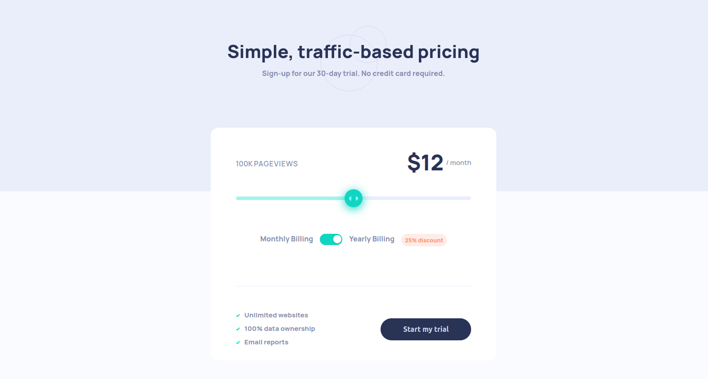
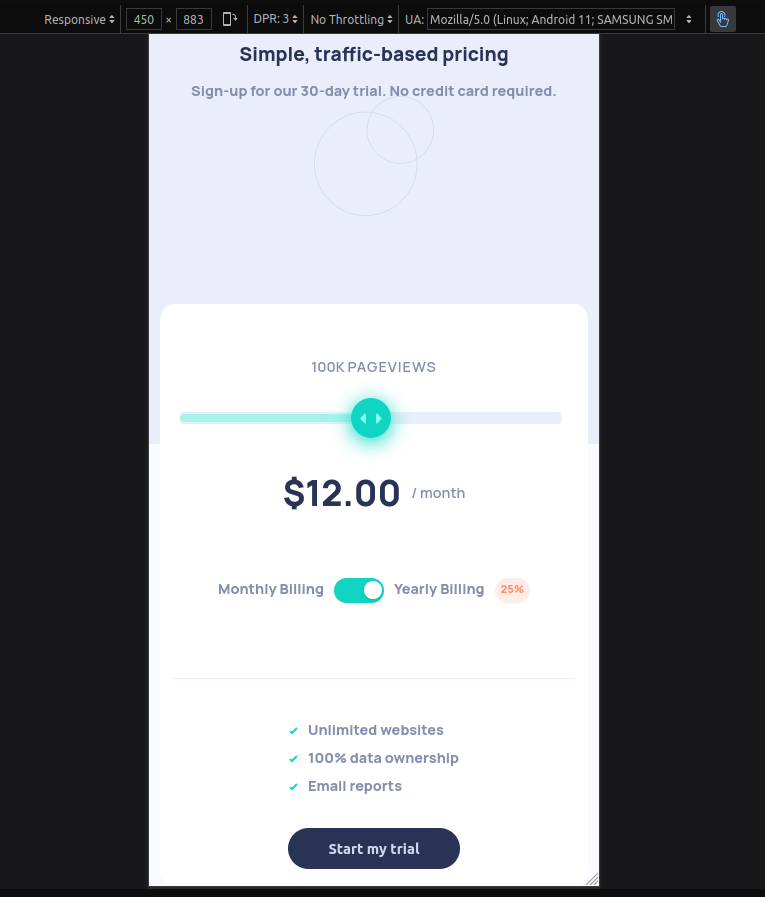

### Interactive Pricing Component

An accessible, responsive pricing component with a range slider and yearly billing discount. Built with vanilla HTML, CSS, and JavaScript.



### Table of contents

- [Interactive Pricing Component](#interactive-pricing-component)
- [Features](#features)
- [Tech stack](#tech-stack)
- [Links](#links)
- [Getting started](#getting-started)
- [Usage](#usage)
- [Screenshots](#screenshots)
- [Project structure](#project-structure)
- [What I learned](#what-i-learned)
- [Deployment](#deployment)
- [Acknowledgments](#acknowledgments)

### Features

- **Responsive layout**: Adapts from mobile to desktop
- **Interactive controls**: Range slider for pageviews, toggle for yearly billing
- **Dynamic pricing**: 25% discount applied for yearly billing
- **Accessible**: Semantic markup and keyboard-usable controls

### Tech stack

- **HTML5**, **CSS3**, **JavaScript (ES6)**

### Links

- Live Demo: add your deployed URL here
- Solution: add your Frontend Mentor solution URL here

### Getting started

1. Clone or download this repository.
2. Open `index.html` directly in your browser, or serve locally:

```bash
# Using Python
python3 -m http.server 5173
# or with Node
npx serve .
```

Then visit `http://localhost:5173` (or the URL shown in your terminal).

### Usage

- Drag the slider to change monthly pageviews; price updates in real time.
- Click the billing toggle to apply a 25% yearly discount.
- Submit button is a demo action per the challenge brief.

### Screenshots




### Project structure

- `index.html` – markup and component structure
- `styles.css` – layout, slider styling, and states
- `script.js` – pricing logic and UI interactions
- `images/`, `design/` – assets and reference designs

### What I learned

- Background split gradient for top/bottom sections using a fixed attachment:

```css
body {
  background: linear-gradient(
    to bottom,
    hsl(224, 65%, 95%) 0%,
    hsl(224, 65%, 95%) 50%,
    hsl(230, 100%, 99%) 50%,
    hsl(230, 100%, 99%) 100%
  );
  background-attachment: fixed;
}
```

- Custom styling for `input[type="range"]` across browsers, including track and thumb:

```css
input[type="range"] {
  appearance: none;
  -webkit-appearance: none;
}
input[type="range"]::-webkit-slider-thumb { /* Chrome/Safari thumb */ }
input[type="range"]::-moz-range-thumb { /* Firefox thumb */ }
input[type="range"]::-moz-range-progress { /* Firefox filled track */ }
```

- Building a **toggle button** with a pseudo-element knob and absolute positioning:

```css
button[type="button"] {
  width: 50px;
  height: 25px;
  border-radius: 25px;
  position: relative;
}
button[type="button"]::before {
  content: "";
  position: absolute;
  width: 10px;
  height: 10px;
  border-radius: 50%;
  left: 2px;
}
```

- Range input essentials: `min`, `max`, and `step` control granularity; use `value` for current state, pair with `<datalist>` for labeled stops, and `<output>` to reflect the value.

### Deployment

- **GitHub Pages**: Push to `main`, then enable Pages in repo settings.
- **Netlify/Vercel**: Drag-and-drop or connect the repo; use default static settings.

### Acknowledgments

Challenge by [Frontend Mentor](https://www.frontendmentor.io). Built by Daniyal Abc Khervi.
